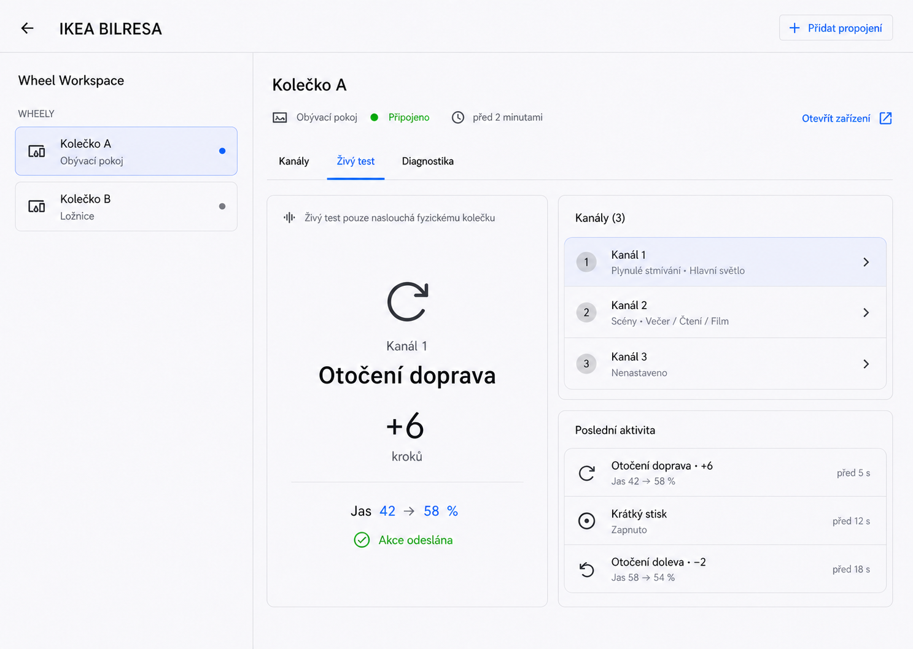

# BILRESA panel product design

Status: **concept only; not implemented**

This document defines the intended product and technical direction for a
future first-party BILRESA panel inside Home Assistant. It is the handoff for
the owner, Codex and Claude Code. The existing Home Assistant integration page
remains the installation and registry surface; the panel would become the
human-oriented product surface.

No panel work should delay the physical release-candidate validation in
`HARDWARE_TEST.md`. The first implementation must be additive and must not
change Matter event decoding, binding behavior or stored configuration.

## Selected visual direction

The owner selected a combination of the workspace and live-test concepts on
2026-07-15:

- the main panel uses the master-detail structure from the wheel-workspace
  concept;
- the left side lists physical wheels and the right side shows the selected
  wheel;
- opening a wheel provides `Channels`, `Live test`, and `Diagnostics` views;
- the live-test concept is therefore a detail of one open physical wheel, not
  the panel's landing page;
- selection and state use real Home Assistant components, theme variables,
  typography, spacing, dividers and standard Material Design Icons;
- generated decorative artifacts such as blue vertical selection bars,
  coloured circular icon buttons, custom progress arcs, gradients or invented
  graphics are not implementation requirements and should be removed;
- the selected implementation target is the sanitized combined reference below.



The image is a visual direction, not proof that the layout or components are
available in Home Assistant. The technical spike in `PANEL_ROADMAP.md` must
rebuild it from supported HA/Lit primitives and validate it in a real HA page.

### Sanitized exploration references

These references preserve the alternatives that led to the selected direction.
They use generic demo names and contain no installation-specific identifiers.

- [Native overview](images/panel/01-native-overview.png)
- [Wheel workspace](images/panel/02-wheel-workspace.png)
- [Live-test device detail](images/panel/03-live-test-detail.png)
- [Selected combined direction](images/panel/04-selected-combined-direction.png)

## Product intent

The panel is not merely a visual replacement for the integration overview. It
should answer three user questions exceptionally well:

1. What does each physical wheel currently control?
2. How do I configure or change that behavior?
3. Is the wheel connected and are its gestures being understood correctly?

It must not become a second Home Assistant. Home Assistant remains responsible
for users, authentication, devices, entities, areas, services, scenes and
automations.

## Relationship to the native integration page

The native integration page is generated by Home Assistant from config entries,
subentries and registry objects. The integration cannot control its card layout,
the `Hubs` grouping, search field or the wording used for devices that are not
assigned to a subentry.

The native page therefore remains the technical administration surface for:

- installing, reloading and removing the integration;
- Home Assistant device and entity registry access;
- native config-entry and subentry operations;
- standard diagnostics and System Health.

The custom panel should present physical wheels, channels, behavior and live
feedback without exposing Matter endpoints or config-entry terminology.

## Information architecture

```text
BILRESA panel
  Overview of physical wheels
    Wheel detail
      Channels and behavior
        Binding editor
      Live test
      Diagnostics
```

The panel should follow Home Assistant's visual language, themes, responsive
layout and accessibility conventions. It should feel like a focused native Home
Assistant page rather than an embedded third-party application.

## Main overview

The top-level summary should remain small and actionable:

- number of connected and unavailable wheels;
- Matter event-source connection state;
- one concise actionable warning when degraded;
- an `Add control binding` action for administrators.

Below it, show one primary card for each physical BILRESA wheel. Each card
should contain:

- user-assigned device name and area;
- connected, degraded or unavailable status;
- time of the last received activity;
- last active channel, clearly labelled as last observed rather than a live
  selector position;
- three channel rows with a human-readable behavior and target summary.

Example channel summary:

| Channel | Behavior | Target |
|---|---|---|
| 1 | Smooth dimming | Bedroom lights |
| 2 | Scene cycling | Evening / Reading / Movie |
| 3 | Not configured | Add binding |

The overview must not show config entries, subentries, Matter node IDs,
endpoint IDs or raw event names.

## Wheel detail

The detail for one wheel has three primary destinations: channels and behavior,
live test, and diagnostics. These may be tabs or another responsive Home
Assistant-native navigation pattern selected during visual prototyping.

### Channels and behavior

Show a separate card for each of the three channels. A configured card should
summarize the behavior of:

- rotation left;
- rotation right;
- short press;
- double and triple press where configured;
- hold and release;
- selected Home Assistant targets.

Technical endpoint and cluster information belongs only in expanded diagnostics.

### Guided binding editor

The editor should use progressive disclosure. The user first chooses a behavior
profile, then sees only fields relevant to that profile.

Initial profile concepts:

- **Smooth light**: rotation changes brightness and press toggles the target.
- **Scenes**: rotation cycles an ordered scene list and press activates the
  selected scene.
- **Media**: volume, play/pause and next/previous behavior.
- **Cover**: position adjustment and stop behavior.
- **Custom action**: advanced Home Assistant actions and targets.
- **Events only**: keep behavior in Home Assistant automations.

Relevant controls may include:

- target entity, device, area, group or scene list as supported by the profile;
- rotation sensitivity;
- inverted direction;
- smooth transition duration;
- short, double and triple press behavior;
- hold-to-ramp settings;
- an explicit disabled state for a channel.

The editor must validate targets before saving, warn about removed or
unavailable targets and present a review summary before a material change.

### Live test

Live test is a core feature, not hidden developer tooling. It should provide a
safe listen-only mode driven by physical BILRESA input and display:

- direction of rotation;
- received cumulative count and calculated delta;
- last active channel;
- single, double and triple press completion;
- hold start and release;
- the resulting action calculated by the integration;
- whether the configured target action was dispatched successfully.

Example human-readable feedback:

```text
Channel 1 · rotate right · +6 steps · brightness 42 -> 58%
```

Entering live test must not itself control a Matter device or synthesize a
hardware gesture. Any future action-preview or target-test control must be
explicit, clearly labelled and protected against accidental actuation.

### Diagnostics

The default diagnostic view should remain understandable:

- connected, degraded or disconnected;
- last received event time;
- event source: Home Assistant core Matter client or passive WebSocket fallback;
- one actionable recovery recommendation when required.

Expanded technical details may include:

- Home Assistant, Matter Server and supported WebSocket schema versions;
- active event source and fallback reason;
- node availability without exposing the node identifier;
- discovered endpoint roles and channels;
- bounded recent event metadata without private identifiers;
- hold watchdog state;
- a link to the standard redacted Home Assistant diagnostics download.

Recent raw activity should be bounded and kept in memory unless a separately
justified requirement proves persistence is necessary. Do not write every
rotation event to the Home Assistant recorder.

## Future product capabilities

The panel can later support:

- copying a channel configuration to another channel;
- copying settings between wheels;
- named behavior presets;
- warnings for missing, removed or unavailable targets;
- conflict and validation checks;
- temporary channel disablement;
- sanitized import and export without installation-specific identifiers;
- guided creation of ordinary Home Assistant automations;
- direct navigation to the relevant HA device, entities and automations;
- bounded quality observations such as last activity, typical batch size and
  incomplete gesture detection.

The panel must not implement a parallel scene engine, automation engine, user
system or long-term history database.

## Hardware and protocol constraints

The UI must describe only capabilities supported by evidence in
`DEVICE_REFERENCE.md`:

- BILRESA reports cumulative counts, not an absolute rotary angle;
- fast rotation is batched by firmware, observed at roughly 0.5-1 second
  intervals;
- the highest observed rotary gesture count is 18;
- a hold event contains no direction;
- the physical selector's current position is not known continuously, so the
  UI must say `last active channel`, not `current channel`;
- a missing long-release event is possible and the runtime watchdog remains
  authoritative.

The panel cannot remove the device-side batching floor or claim real-time
precision that the hardware does not provide.

## Technical architecture

The future panel should be a custom element registered inside Home Assistant.
It receives Home Assistant state and themes through the frontend `hass` object
and communicates only with the loaded Python integration.

```text
Matter Server
    |
Python IKEA BILRESA integration
    |-- Home Assistant devices and entities
    |-- binding configuration and gesture processing
    |-- redacted diagnostics and System Health
    `-- authenticated BILRESA WebSocket API
             |
        BILRESA panel
```

Architecture rules:

- The Python integration remains the single source of truth.
- The browser must not connect directly to Matter Server.
- All Matter access remains passive and read-only.
- Important configuration must never exist only in browser storage.
- Read operations use authenticated Home Assistant WebSocket subscriptions.
- Mutating WebSocket commands require explicit schemas, server-side validation
  and administrator authorization.
- Non-admin users may receive a read-only experience if product testing shows
  it is useful.
- Existing config flows remain a functional fallback and recovery path.
- Panel failure must not stop gesture processing or configured bindings.
- Frontend assets must be versioned to avoid stale browser caches after an
  integration upgrade.
- English and Czech UI strings must remain aligned.
- Desktop, tablet, narrow mobile layout, keyboard navigation, focus states,
  screen-reader labels, loading, empty, degraded and error states are required.

Home Assistant reference material:

- [Creating custom panels](https://developers.home-assistant.io/docs/frontend/custom-ui/creating-custom-panels/)
- [Frontend architecture](https://developers.home-assistant.io/docs/frontend/architecture/)
- [Extending the WebSocket API](https://developers.home-assistant.io/docs/frontend/extending/websocket-api)
- [Authentication permissions](https://developers.home-assistant.io/docs/auth_permissions/)

## Delivery sequence and provisional versions

The sequence deliberately starts read-only to avoid risking the existing
binding configuration.

### `0.5.8` - read-only panel

- overview cards for physical wheels;
- channel and current binding summaries;
- connection and event-source state;
- live hardware event visualization;
- read-only bounded diagnostics.

This phase validates frontend packaging, cache behavior, themes, responsive
layout and live subscriptions without creating a new write path.

### `0.5.9` - binding editor

- edit the existing binding model through the panel;
- administrator-only validated writes;
- target availability warnings;
- review and save states;
- native config flows retained as fallback.

### `0.5.10` - workflows and polish

- guided behavior profiles;
- copy channel and copy wheel actions;
- refined empty, loading, degraded and error states;
- accessibility and mobile polish.

### `0.5.11+` - carefully selected expansion

- additional proven target types;
- sanitized import/export;
- guided HA automation creation;
- extended bounded troubleshooting observations.

These version numbers are planning labels, not releases or promises. A larger
stored-config migration, subentry-model change or intentional compatibility
break requires a minor version such as `0.6.0` under `ROADMAP.md`.

## First implementation recommendation

The first implementation should be a read-only panel containing wheel cards,
channel summaries, connection status and live test. This provides visible value
without changing binding storage or behavior and proves the frontend delivery
architecture before any panel write access is introduced.

Before implementation, create and compare exactly three visual directions using
real Home Assistant desktop and mobile references. Validate at minimum these
states:

- one wheel with one binding;
- two wheels with mixed configured and empty channels;
- five or more wheels;
- disconnected Matter event source;
- unavailable target;
- active live gesture;
- narrow mobile layout;
- Czech and English text expansion.

Do not begin panel implementation merely from this prose specification. Select
a visually verified direction first, then create a small technical spike for
panel registration, asset loading and a read-only WebSocket subscription.
